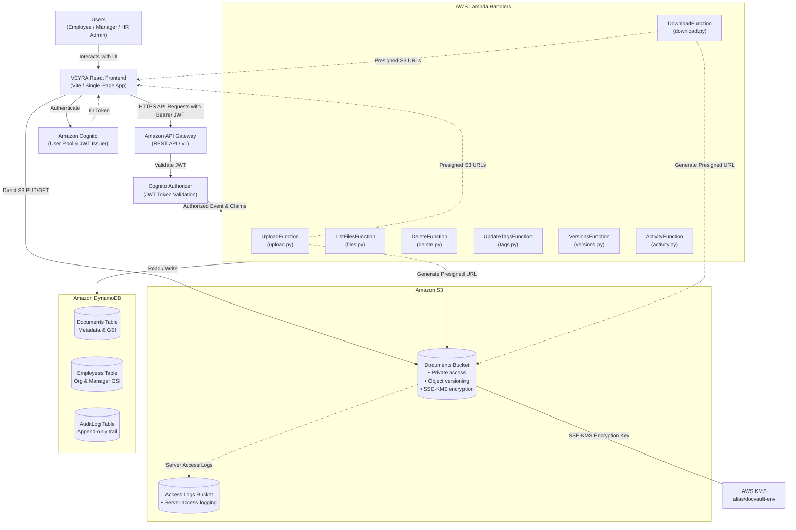
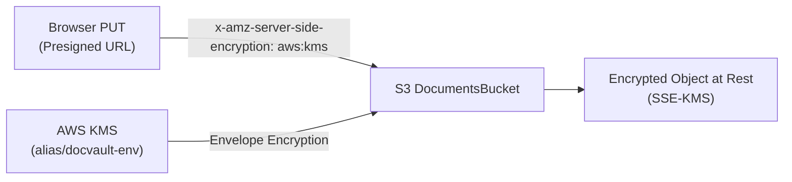
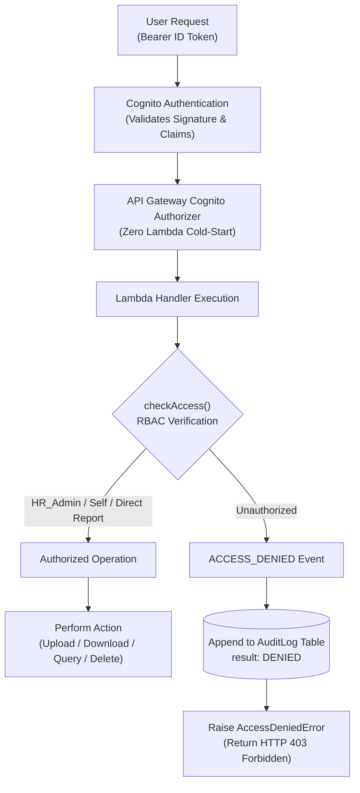
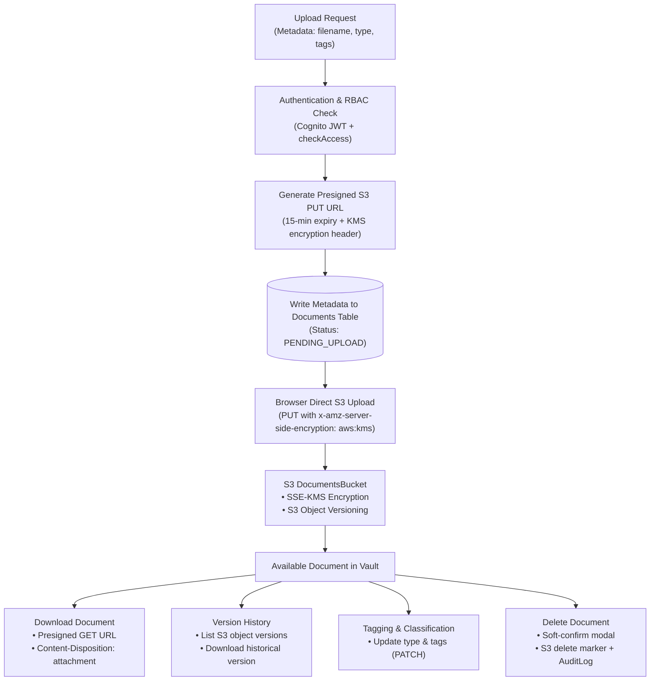

# VEYRA — Employee Document Workspace

> **Secure, role-aware HR document management on AWS** — upload, tag, search, version-history, and audit-log every employee document with full end-to-end encryption and least-privilege access control.

[](#testing)
[](#testing)
[](#deployment)
[](https://ap-south-1.console.aws.amazon.com/)

---

## Table of Contents

1. [Overview](#overview)
2. [Key Features](#key-features)
3. [Architecture](#architecture)
4. [Security Controls](#security-controls)
5. [Role-Based Access Control (RBAC)](#role-based-access-control-rbac)
6. [AWS Services](#aws-services)
7. [API Reference](#api-reference)
8. [Data Model](#data-model)
9. [Directory Structure](#directory-structure)
10. [Local Development](#local-development)
11. [Deployment](#deployment)
12. [Testing](#testing)
13. [Further Documentation](#further-documentation)

---

## Overview

VEYRA is a **serverless**, **cloud-native** HR document workspace built entirely on AWS using the AWS Serverless Application Model (SAM). It gives employees, managers, and HR administrators a unified, role-aware interface to manage sensitive employment documents — offer letters, payslips, ID proofs, appraisals, and more — with zero file-size bottleneck (direct S3 presigned-URL uploads/downloads), full version history, and an immutable audit trail.

Every operation is authenticated via **Amazon Cognito** and authorized by an application-layer **RBAC engine** before any S3 presigned URL or DynamoDB data is returned to the caller.

---

## Key Features

| Category | Feature |
|---|---|
| **Authentication** | Amazon Cognito User Pool — email/password, JWT ID tokens (60-min validity) |
| **Authorization** | Three-tier RBAC enforced at Lambda layer — Employee / Manager / HR_Admin |
| **Document upload** | Presigned S3 PUT URLs with SSE-KMS; browser never holds AWS credentials |
| **Document download** | Presigned S3 GET URLs with `Content-Disposition: attachment` to force download |
| **Version history** | Full S3 object versioning; restore or download any historical version |
| **Tagging & classification** | Document type, sensitivity classification, custom free-text tags per document |
| **Full-text search & filter** | Client-side search across filename, type, and tags with instant filtering |
| **Audit log** | Append-only DynamoDB `AuditLog` table — every upload, download, delete, and access denial recorded |
| **Activity page** | Paginated, filterable audit event viewer for HR Admins and Managers |
| **Delete with confirm** | Soft-confirm modal before permanent document deletion |
| **Encryption** | SSE-KMS on S3, AWS-managed SSE on DynamoDB, HTTPS-only at all layers |
| **S3 access logging** | Separate access-log bucket receives S3 server access logs from the documents bucket |

---

## Architecture

### High-Level Architecture



### S3 Two-Bucket Design

VEYRA uses two separate S3 buckets to comply with the AWS best-practice requirement that a bucket must not log to itself:

| Bucket | Name Pattern | Purpose |
|---|---|---|
| **Documents** | `docvault-employee-documents-<env>-<account_id>` | All employee HR documents (private, versioned, SSE-KMS) |
| **Access logs** | `docvault-access-logs-<env>-<account_id>` | S3 server access logs delivered from the Documents bucket |

### S3 Object Key Structure

```
documents/{employee_id}/{document_type}/{filename}
```

**Example:**
```
documents/EMP-00123/offer-letter/offer_letter_2024.pdf
```

---

## Security Controls

| Layer | Control |
|---|---|
| **Transport** | HTTPS enforced at API Gateway and via `aws:SecureTransport` bucket policies on both S3 buckets |
| **Authentication** | Amazon Cognito User Pool — email/password, short-lived JWT tokens |
| **Token validation** | API Gateway Cognito Authorizer validates JWT signature before invoking any Lambda (zero cold-start cost) |
| **Application authorization** | `checkAccess()` in `backend/shared/auth.py` enforces RBAC on every handler |
| **Credentials** | Browser never receives AWS credentials; only short-lived presigned S3 URLs |
| **Encryption at rest** | SSE-KMS (Documents S3 bucket via `alias/docvault-<env>`), AWS-managed SSE (DynamoDB tables) |
| **Key rotation** | KMS key annual rotation enabled |
| **S3 visibility** | Block Public Access enabled at bucket level; all objects private |
| **Versioning** | S3 versioning prevents accidental overwrites and deletions |
| **Audit trail** | Every significant action — upload, download, delete, access denial — is written to the append-only `AuditLog` DynamoDB table |
| **PITR** | DynamoDB Point-In-Time Recovery enabled on all tables |
| **Content-Disposition** | Presigned download URLs include `Content-Disposition: attachment; filename="..."` to prevent browser rendering of sensitive files |

### KMS Encryption Flow



---

## Role-Based Access Control (RBAC)

Three Cognito groups map directly to RBAC roles. The `checkAccess()` helper (called at the start of every Lambda handler) grants or denies access **before** any business logic runs:

| Role | Cognito Group | Access Scope |
|---|---|---|
| **HR_Admin** | `HR_Admin` | **All** employees — unrestricted read, upload, delete, activity |
| **Manager** | `Manager` | Own documents **+** all direct reports (resolved via `manager_id-index` GSI) |
| **Employee** | `Employee` | Own documents only |

### Authorization Logic

```python
# backend/shared/auth.py — checkAccess()
1. Extract custom:employee_id and cognito:groups from JWT claims
2. HR_Admin  → grant immediately
3. Manager   → grant if target == self  OR  target ∈ direct_reports
4. Employee  → grant only if target == self
5. Any denial → write ACCESS_DENIED to AuditLog + raise AccessDeniedError (HTTP 403)
```

### Security & RBAC Flow



Every denied access attempt writes an audit record before raising the error. The denial reason is logged but **never returned to the client** (prevents information leakage).

---

## Document Lifecycle



---

## AWS Services

| Service | Resource | Purpose |
|---|---|---|
| **Amazon Cognito** | `docvault-user-pool-<env>` | User authentication — email/password, JWT issuance |
| **Amazon Cognito** | `docvault-client-<env>` | SPA app client (no secret) |
| **API Gateway** | `docvault-api-<env>` (stage `v1`) | HTTPS REST API with Cognito default authorizer |
| **AWS Lambda** | 7 Python 3.11 functions | Upload, download, list, tags, versions, delete, activity |
| **Amazon S3** | `docvault-employee-documents-<env>-<acct>` | Document storage (private, versioned, SSE-KMS) |
| **Amazon S3** | `docvault-access-logs-<env>-<acct>` | S3 server access logs |
| **Amazon DynamoDB** | `Documents-<env>` | Document metadata + `employee_id-index` GSI |
| **Amazon DynamoDB** | `AuditLog-<env>` | Append-only audit trail |
| **Amazon DynamoDB** | `Employees-<env>` | Employee identity + `manager_id-index` GSI |
| **AWS KMS** | `alias/docvault-<env>` | SSE-KMS encryption key for Documents bucket |

---

## API Reference

All endpoints require `Authorization: Bearer <Cognito ID Token>`. API Gateway validates the token via Cognito Authorizer before invoking Lambda.

### Documents & Files

| Method | Path | Handler | Lambda Resource | Description |
|---|---|---|---|---|
| `POST` | `/upload` | `upload.py` | `UploadFunction` | Generate presigned S3 PUT URL with SSE-KMS headers; write initial metadata (`PENDING_UPLOAD`) |
| `GET` | `/files` | `files.py` | `ListFilesFunction` | List accessible documents for caller (RBAC-filtered via `employee_id-index`) |
| `GET` | `/download/{doc_id}` | `download.py` | `DownloadFunction` | Generate presigned S3 GET URL with `Content-Disposition: attachment; filename="..."` |
| `DELETE` | `/files/{doc_id}` | `delete.py` | `DeleteFunction` | Delete document from vault (S3 delete marker + marks deleted in DynamoDB) |
| `PATCH` | `/files/{doc_id}` | `tags.py` | `UpdateTagsFunction` | Update document tags, classification, and document type |
| `GET` | `/files/{doc_id}/versions` | `versions.py` | `VersionsFunction` | List all historical S3 object versions and delete markers for a document |

#### Version-Specific Downloads

To download a specific historical version rather than the latest version, pass `version_id` as a query parameter to the download endpoint:

```
GET /download/{doc_id}?version_id=<version_id>
```

The `DownloadFunction` verifies RBAC access, retrieves the historical version metadata from S3 using `s3:GetObjectVersion`, and generates an authenticated presigned URL scoped directly to that `VersionId`.

### Activity & Audit Log

| Method | Path | Handler | Lambda Resource | Description |
|---|---|---|---|---|
| `GET` | `/activity` | `activity.py` | `ActivityFunction` | Paginated audit log (HR_Admin: all; Manager: own + reports; Employee: own) |

---

## Data Model

### `Documents-<env>` — Document Metadata

| Attribute | Type | Key | Notes |
|---|---|---|---|
| `document_id` | String | **PK** | UUID generated at upload |
| `employee_id` | String | GSI PK | Links to Employees table and S3 key |
| `upload_timestamp` | Number | GSI SK | Unix epoch milliseconds |
| `document_type` | String | — | e.g. `offer-letter`, `payslip` |
| `s3_key` | String | — | Full S3 object key |
| `file_name` | String | — | Original filename |
| `file_size` | Number | — | Bytes |
| `uploader_id` | String | — | `employee_id` of the uploader |
| `classification` | String | — | e.g. `Confidential`, `Internal`, `Public` |
| `tags` | List | — | Free-text tag array |

**GSI:** `employee_id-index` — PK: `employee_id`, SK: `upload_timestamp`, Projection: ALL

### `AuditLog-<env>` — Append-Only Audit Trail

| Attribute | Type | Key | Notes |
|---|---|---|---|
| `log_id` | String | **PK** | UUID per event |
| `timestamp` | Number | **SK** | Unix epoch milliseconds |
| `action` | String | — | `UPLOAD`, `DOWNLOAD`, `DELETE`, `ACCESS_DENIED`, `TAG_UPDATE`, … |
| `result` | String | — | `SUCCESS` or `DENIED` |
| `actor_id` | String | — | Caller's `employee_id` |
| `resource_id` | String | — | Target document or employee ID |
| `cognito_sub` | String | — | Caller's Cognito sub (for correlation) |

### `Employees-<env>` — Employee Identity

| Attribute | Type | Key | Notes |
|---|---|---|---|
| `employee_id` | String | **PK** | Matches `custom:employee_id` in Cognito JWT |
| `manager_id` | String | GSI PK | `employee_id` of direct manager |
| `full_name` | String | — | Display name |
| `email` | String | — | Work email (mirrors Cognito username) |
| `department` | String | — | Department or team |
| `job_title` | String | — | Job title |
| `active` | Boolean | — | `false` when employee has left |

**GSI:** `manager_id-index` — PK: `manager_id`, Projection: ALL
Used by `checkAccess()` to resolve direct reports for Manager RBAC.

---

## Directory Structure

```
.
├── infra/
│   ├── template.yaml          # AWS SAM template (all resources)
│   └── README.md              # Infrastructure reference
│
├── backend/
│   ├── handlers/
│   │   ├── upload.py          # POST /upload
│   │   ├── download.py        # GET /download/{doc_id} (?version_id=...)
│   │   ├── files.py           # GET /files
│   │   ├── tags.py            # PATCH /files/{doc_id}
│   │   ├── versions.py        # GET /files/{doc_id}/versions
│   │   ├── delete.py          # DELETE /files/{doc_id}
│   │   └── activity.py        # GET /activity
│   ├── shared/
│   │   ├── auth.py            # checkAccess() RBAC engine
│   │   └── s3.py              # Presigned URL helpers
│   └── run_tests_stdlib.py    # Backend test runner (stdlib unittest)
│
├── frontend/
│   ├── src/
│   │   ├── pages/
│   │   │   ├── LoginPage.jsx
│   │   │   ├── DashboardPage.jsx
│   │   │   ├── DocumentsPage.jsx
│   │   │   └── ActivityPage.jsx
│   │   ├── components/
│   │   │   ├── Sidebar.jsx
│   │   │   ├── Navbar.jsx
│   │   │   ├── DocumentUpload.jsx
│   │   │   ├── VersionHistoryDrawer.jsx
│   │   │   ├── DeleteConfirmModal.jsx
│   │   │   └── ClassificationBadge.jsx
│   │   ├── services/
│   │   │   ├── api.js         # Authenticated API client
│   │   │   └── authUtils.js   # Cognito session helpers
│   │   └── hooks/
│   │       └── useAuth.js     # Auth state hook
│   ├── vite.config.js         # Vite + dev proxy to API Gateway
│   └── README.md
│
└── docs/
    ├── architecture.md        # Detailed architecture reference
    ├── auth.md                # Auth & RBAC specification
    └── deliverables.md        # Project deliverables checklist
```

---

## Local Development

### Prerequisites

| Tool | Version |
|---|---|
| Node.js | 18+ |
| Python | 3.12 |
| AWS SAM CLI | 1.100+ |
| AWS CLI | 2.x (profile: `docvault`) |

### Frontend

```bash
cd frontend
npm install
npm run dev          # Starts Vite at http://localhost:5173
```

The Vite dev server proxies `/api` requests to the deployed API Gateway endpoint (`ap-south-1`). No separate backend process is needed for frontend development.

### Backend Tests

```bash
python3 backend/run_tests_stdlib.py
# Ran 69 tests — OK
```

### Frontend Tests

```bash
cd frontend
npm test -- --run
# 142 tests passed (11 test files)
```

### Lint & Build

```bash
cd frontend
npm run lint
npm run build
```

---

## Deployment

> **Region:** `ap-south-1` &nbsp;|&nbsp; **Profile:** `docvault`

### Validate

```bash
sam validate --lint --template-file infra/template.yaml
```

### Build

```bash
sam build --template-file infra/template.yaml
```

### Deploy (first time)

```bash
sam deploy \
  --template-file infra/template.yaml \
  --stack-name employee-document-vault-dev \
  --region ap-south-1 \
  --capabilities CAPABILITY_IAM \
  --parameter-overrides Env=dev
```

### Promote to staging / prod

```bash
sam deploy \
  --template-file infra/template.yaml \
  --stack-name employee-document-vault-prod \
  --region ap-south-1 \
  --capabilities CAPABILITY_IAM \
  --parameter-overrides Env=prod
```

### SAM Parameters

| Parameter | Default | Allowed Values |
|---|---|---|
| `Env` | `dev` | `dev`, `staging`, `prod` |

---

## Testing

### Backend (Python `unittest`)

```
python3 backend/run_tests_stdlib.py

Ran 69 tests in 0.027s — OK
```

Covers: upload handler, download handler (with `version_id`), file listing, tag updates, version listing, delete, activity pagination, `checkAccess()` RBAC engine, presigned URL generation, and `Content-Disposition` sanitization.

### Frontend (Vitest + jsdom)

```
cd frontend && npm test -- --run

Test Files  11 passed (11)
     Tests  142 passed (142)
```

Covers: API client (`getIdToken`, `getDownloadUrl`, `getActivity`), RBAC-aware rendering, upload flow, version history drawer (version download, delete markers, error states), document filtering and search, and authenticated route protection.

---

## Further Documentation

| Document | Description |
|---|---|
| [docs/architecture.md](docs/architecture.md) | Detailed component descriptions, data flow diagrams, S3 two-bucket design |
| [docs/auth.md](docs/auth.md) | Full authentication & RBAC specification, `checkAccess()` behaviour, JWT claims |
| [docs/deliverables.md](docs/deliverables.md) | Project deliverables checklist |
| [infra/README.md](infra/README.md) | SAM template reference — naming conventions, DynamoDB schema, deployment guide |
